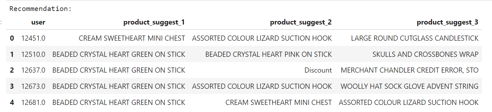
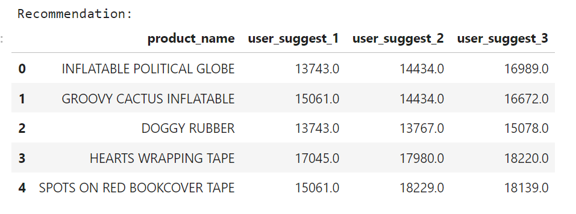

# E-commerce data analytics

The dataset taken from [Kaggle](https://www.kaggle.com/datasets/carrie1/ecommerce-data) includes the following information: InvoiceNo, StockCode, Description, Quantity, InvoiceDate, UnitPrice, CustomerID, and Country.

---

## **Objective**:

Analyze customer purchase data to make recommendations for optimizing business operations and propose solutions to increase revenue.

---

## **Ideas**

1. Imports Libraries and Packages, Import Dataset
2. Data Preprocessing
3. Exploratory Data Analysis
4. RFM Analysis

---

## **Summary of Key Points from this Dataset:**

- The dataset has several issues, such as::
  - About 3% of orders contain 2 identical products in one order, which might be duplicated. It's necessary to check whether this is a system feature.
  - 15% of orders and 25% of records lack customer information. The number of orders without customer information varies by day, with some days having a lot of such orders.
    - There might be an issue with the data storage system, possibly due to system errors on those days. This should be checked.
    - Alternatively, it might be because customers didn’t provide information during checkout, making it impossible to store their details. Therefore, it’s recommended to introduce incentive programs like membership cards or reward points to encourage customers to provide their information when purchasing.
  - The product name attribute (Description) is missing in many instances. Some product codes have up to 10 different names (e.g., '20713'), and these names don’t follow any pattern, which suggests that this field might be manually entered by users. It's necessary to check the logic when cashiers scan products for payment. Does the system automatically query the product attribute to get the Description? This step needs to be fixed to ensure data consistency.
- After the analysis, several observations were made:

  - The data entirely lacks orders from Saturdays, which are typically peak days for sales. The absence of this data, if not addressed, will significantly affect the quality of the analysis.
  - The main purchasing time during the day is around 12 PM, which suggests that these products might be targeting office workers who shop during their lunch break. Expanding stores in large office buildings could be considered.
    

  - Customers from nearly 40 countries have made purchases, but most of them are concentrated in Europe. Countries showing strong growth (excluding the UK) include Germany, France, and Belgium. It might be worth exploring these markets further to expand the scale.
    

  - When examining the top 20 product pairs frequently bought together, 7 pairs include the product 'JUMBO BAG RED RETROSPOT.' This could be a lead product, and creating combos that include this item could boost sales of other products.

- **RFM Model Analysis:**
  

  - The 1-1-1 and 3-3-3 labels account for the largest percentages: Group 1-1-1 represents the best customers (high purchase frequency, large transaction value, and recent transactions), while Group 3-3-3 might be less active customers (infrequent purchases, low transaction value, and fewer recent transactions).
    => The business should focus on maintaining and improving the experience of high-value customer groups (Group 1-1-1) and finding ways to reactivate customers in less engaged groups (Group 3-3-3).

  - Example of Group 1-1-1: This group could be targeted with exclusive marketing programs. For instance, they could be offered discount vouchers when they refer a friend who makes a purchase, applicable to certain products they’ve bought frequently before. This not only shows appreciation but also attracts new customers.
  - Group 3-3-3: This group is quite large, indicating many customers who make only one purchase and then leave. Therefore, new customers with a 3-x-x score should be given a voucher for their second purchase right away.

- **Recomndation system**:
  I continued to try creating a product recommendation system based on the method: Neighborhood-Based Collaborative Filtering, mainly focusing on user or item similarities to make predictions. This method works by finding either users with similar preferences (user-based) or items that are similar to those the user has previously liked (item-based).
  - In user-based filtering, recommendations are made based on the preferences of users with similar behavior. If two users have similar tastes, the system will suggest items liked by one to the other.
    
  - In item-based filtering, the system looks for items that are similar to those the user has rated or interacted with before, and then recommends new items based on those similarities.
    
